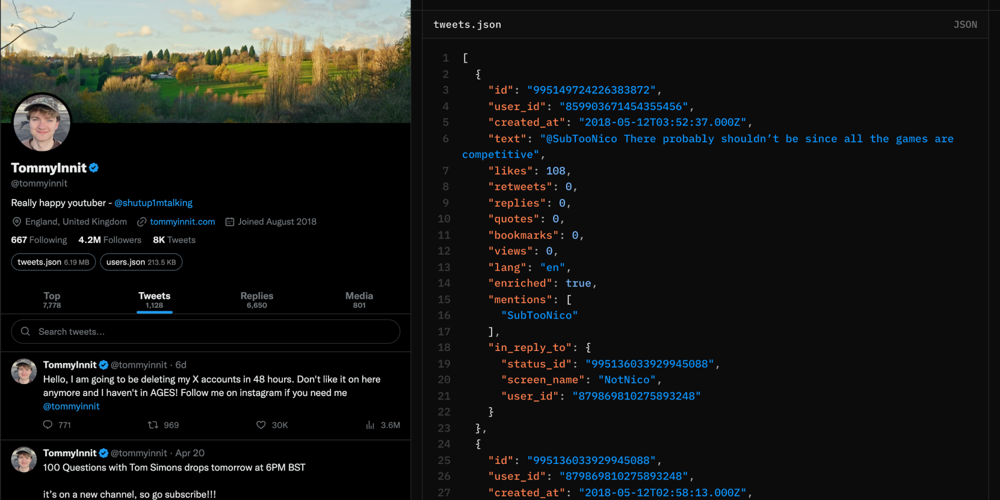

<h3 align="center">a simple cli to archive twitter profiles</h3>

captures tweets, replies, media (photos, videos, gifs), quote tweets, link embeds, and every referenced author's profile.

```bash
bunx twitter-archiver elonmusk --token "..." --zip
```

cycle several accounts (spreads rate limits):

```bash
ARCHIVER_TOKENS="AAA,BBB,CCC" bun run src/cli.js jack
```

### options

| flag | description |
| --- | --- |
| `--token <auth_token>` | an `auth_token` cookie value. repeatable for multiple accounts. |
| `--tokens-file <path>` | file with one `auth_token` per line (or comma/space separated). |
| `--out <dir>` | output directory. default: `<handle>-archive`. |
| `--zip` | also produce a `<out>.zip` alongside the folder. |
| `--client <name>` | emusks client to emulate (e.g. `tweetdeck`). default: `web`. |
| `--endpoint <name>` | graphql endpoint: `web` \| `main` \| `tweetdeck` \| ... |
| `--concurrency <n>` | parallel media downloads. default: `12`. |

tokens can also come from the `ARCHIVER_TOKENS` env var.

### finding your auth token

1. open [x.com](https://x.com) logged in
2. devtools > application > cookies > `https://x.com`
3. copy the value of `auth_token`

any account that hits a rate limit is cooled down while the others keep working.

## viewing your archive

you should serve your archive folder with a static server:

```bash
cd <handle>-archive && bunx serve
```

to share it, upload the folder to any static host (cloudflare pages, etc.). pass `--zip` to also get a single archive file.

## license

[AGPLv3.0](./LICENSE)

please ensure you have permission before archiving tweets from any user.

not affiliated with X Corp. viewer by [cv](https://coolsite.cv)